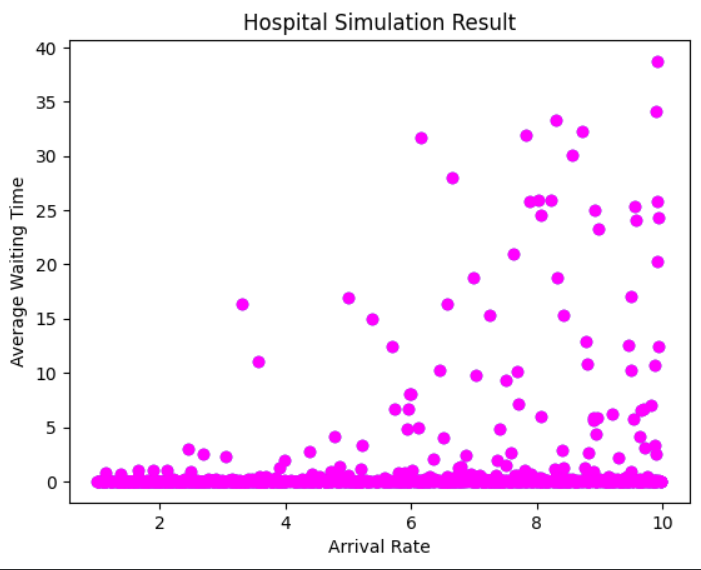

# 🏥 Data Generation using Modelling & Simulation for Machine Learning  
### UCS654 – Assignment 6  
---

## 📌 Project Overview

In many real-world systems, collecting large-scale real data is expensive, slow, or sometimes impractical.  
Modelling and simulation provide a powerful alternative by generating **synthetic yet realistic datasets**.

In this project, a **Hospital Queue System** is simulated using **SimPy**, and the generated dataset is used to train and compare multiple Machine Learning regression models.

This assignment demonstrates how simulation-based modelling can effectively support predictive analytics.

---

# 🚀 Simulation Tool Used

## 🧠 SimPy – Discrete Event Simulation Library

**SimPy** is an open-source Python library used for modelling:

- Queueing systems  
- Resource allocation  
- Service environments  
- Process scheduling  

It integrates seamlessly with Python-based ML workflows.

---

# 🏥 Problem Description

A **Hospital Patient Queue System** is simulated where:

- Patients arrive randomly  
- Doctors are limited shared resources  
- Each patient experiences waiting time before treatment  

🎯 **Goal:**  
To analyze how system parameters influence **Average Waiting Time**, and to train ML models that predict waiting time based on those parameters.

---

# ⚙️ Simulation Model & Parameters

## 🔄 Model Type

Discrete-event simulation using SimPy:

- Patient arrivals → Exponential distribution  
- Service times → Exponential distribution  
- Doctors → Limited resource pool  

---

## 📊 Parameter Bounds

| Parameter        | Description                         | Lower Bound | Upper Bound |
|------------------|-------------------------------------|-------------|-------------|
| arrival_rate     | Patient arrival rate                | 1           | 10          |
| service_rate     | Doctor service rate                 | 2           | 12          |
| doctors          | Number of available doctors         | 1           | 5           |
| simulation_time  | Total simulation duration           | 100         | Fixed       |

These bounds ensure realistic and stable system behavior.

---

# 🔁 Data Generation Methodology

The following steps were performed:

1️⃣ Random parameter values were generated within defined bounds  
2️⃣ Parameters were passed into the SimPy simulation  
3️⃣ The simulation was executed for a fixed duration  
4️⃣ The average waiting time was recorded  
5️⃣ The process was repeated **1000 times**  

Each simulation run produced one dataset sample.

---

# 📂 Dataset Description

The generated dataset contains:

| Feature Name     | Description |
|------------------|------------|
| arrival_rate     | Patient arrival rate |
| service_rate     | Doctor service rate |
| doctors          | Number of doctors |
| avg_wait_time    | Average patient waiting time (Target Variable) |

The dataset is saved as:

```
simulation_data.csv
```

---

# 📈 Data Visualization

The scatter plot below visualizes the relationship between **arrival rate** and **average waiting time**.

Higher arrival rates generally lead to increased waiting times when system capacity becomes saturated.

### 📊 Hospital Simulation Result

<p align="center">
  
</p>

---

# 🤖 Machine Learning Models Used

The following regression models were trained and evaluated:

1️⃣ Linear Regression  
2️⃣ Decision Tree Regressor  
3️⃣ Random Forest Regressor  
4️⃣ Gradient Boosting Regressor  
5️⃣ Support Vector Regressor (SVR)  
6️⃣ K-Nearest Neighbors Regressor (KNN)  

---

# 📏 Model Evaluation Metrics

Models were evaluated using:

- 📉 **Mean Squared Error (MSE)**  
- 📊 **R² Score**

These metrics allow accurate performance comparison across models.

---

# 🏆 Results & Model Comparison

The performance comparison of all trained regression models is shown below:

<p align="center">
  
</p>

📌 **Key Observations:**

- **K-Nearest Neighbors (KNN)** achieved the lowest MSE and highest R² score.
- Ensemble models such as **Random Forest** and **Gradient Boosting** performed strongly.
- Linear models showed comparatively weaker performance due to nonlinear system behavior.

---

# 🧠 Key Insights

✔ Simulation successfully generated meaningful synthetic data  
✔ Queue system behavior aligns with theoretical expectations  
✔ Machine Learning models effectively captured system patterns  
✔ Ensemble and instance-based models outperformed simple linear approaches  

---

# 🎯 Conclusion

This project demonstrates the integration of:

- 🧮 Mathematical Modelling  
- 🔄 Discrete-Event Simulation  
- 🤖 Machine Learning  

Simulation-based data generation is valuable when:

- Real-world data is limited  
- Data collection is expensive  
- Controlled experimentation is required  

The integration of SimPy with ML provides a scalable framework for predictive modeling.

---

# 📂 Repository Structure

```
Modelling_and_Simulation/
│
├── simpy_hospital_simulation.ipynb
├── simulation_data.csv
├── pink_plot.png
├── model_comparison.png
└── README.md
```

---

# ▶ How to Run

1. Open the notebook in Google Colab  
2. Install SimPy:

```
pip install simpy
```

3. Run all cells sequentially  
4. Observe simulation results, plots, and ML comparison  

---

# ✨ Technologies Used

- Python  
- SimPy  
- NumPy  
- Pandas  
- Matplotlib  
- Scikit-learn  

---

# 👩‍💻 Author

**Savree Dohar**  
Roll No: 102317097  
UCS654 – Predictive Analytics & Statistics  
